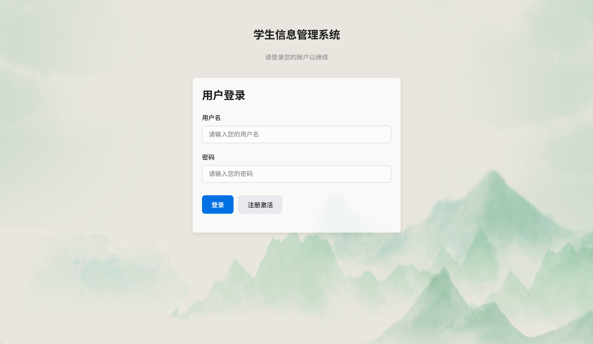
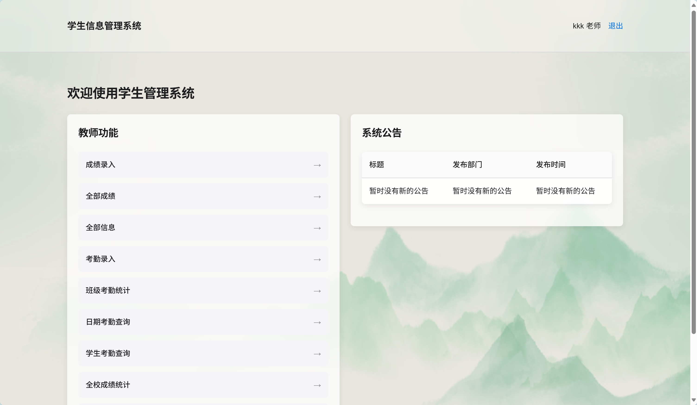
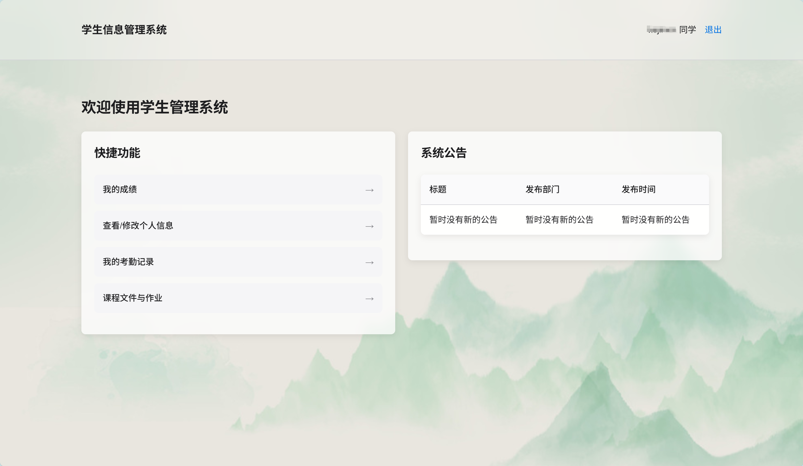

# 学生信息管理系统

## 1. 项目简介

本项目是一个基于 **Spring Boot + MyBatis-Plus + Shiro + Thymeleaf** 的学生信息管理系统。系统旨在为教学管理提供便利，实现了对学生基本信息、成绩、考勤及教学文件的全面管理。系统通过 **Apache Shiro** 实现了基于角色的权限控制（RBAC），精确划分了 **学生** 和 **教师** 的操作权限。

## 2. 功能模块

系统的核心功能围绕 **学生** 和 **教师** 两种角色展开：

### 学生端 (`Role ID: 1`)

-   **个人主页**: 登录后进入学生专属主页。
-   **学籍管理**:
    -   首次登录或信息不有时，填写个人详细信息。
    -   查看并更新自己的学籍信息。
-   **成绩查询**:
    -   查看个人所有科目的成绩列表。
    -   以图表形式查看个人成绩的统计分析。
-   **考勤记录**:
    -   查看个人的考勤统计（如出勤、迟到、请假天数）。
-   **文件中心**:
    -   下载教师发布的课程课件（PPT）。
    -   上传和更新自己的作业。
    -   下载教师批改后返回的作业。

### 教师端 (`Role ID: 2`)

-   **教师主页**: 登录后进入教师专属主页。
-   **学籍管理**:
    -   查看所有学生的信息列表。
    -   按学号查询特定学生的信息。
-   **成绩管理**:
    -   录入学生成绩。
    -   查看所有学生的成绩列表，并可按学号筛选。
    -   更新指定条目的成绩信息。
    -   按班级、按科目进行成绩的统计与图表分析。
    -   将统计数据导出为 CSV 文件。
-   **考勤管理**:
    -   为学生录入考勤记录（正常、迟到、缺勤等）。
    -   按学生、按班级、按日期查询考勤记录和统计数据。
    -   编辑或删除已有的考勤记录。
-   **文件管理**:
    -   上传课程课件（PPT）供学生下载。
    -   查看所有学生提交的作业。
    -   上传已批改的作业给特定学生。

## 3. 技术栈

-   **核心框架**: Spring Boot `2.1.9.RELEASE`
-   **安全框架**: Apache Shiro `1.4.0`
-   **持久层框架**: MyBatis-Plus `3.0.7.1`
-   **数据库**: MySQL `8.0`
-   **模板引擎**: Thymeleaf
-   **API文档**: Swagger2 `2.9.2`
-   **工具集**: Lombok, Commons Lang3

## 4. 快速开始

### 4.1 环境准备

-   JDK 1.8
-   Maven 3.x
-   MySQL 5.7+

### 4.2 步骤

1.  **克隆项目到本地**
    ```bash
    git clone https://github.com/GoldenKerwin/StudentController.git
    cd student_controller
    ```

2.  **创建数据库**
    -   启动 MySQL 服务。
    -   创建名为 `student_controller` 的数据库。
    -   执行项目根目录下的 `db_create.sql` 文件，以创建表结构和插入初始数据。
      ```sql
      -- 使用 MySQL 命令行客户端执行
      source /path/to/your/project/db_create.sql;
      ```

3.  **修改配置**
    -   打开 `src/main/resources/application.yml` 文件。
    -   根据你的本地环境，修改 `spring.datasource` 下的数据库连接信息，特别是 `username` 和 `password`。
      ```yaml
      spring:
        datasource:
          url: jdbc:mysql://localhost:3306/student_controller?serverTimezone=UTC&useUnicode=true&characterEncoding=utf-8
          username: root       # 修改为你的数据库用户名
          password: your_password   # 修改为你的数据库密码
      ```

4.  **重要：配置上传文件目录**
    -   项目中的文件上传功能默认使用硬编码路径 `D:/student-system-uploads-default/`。
    -   **首次运行前，请务必在你的D盘下创建此文件夹**，否则文件上传功能会失败。
    -   **推荐做法**：在 `application.yml` 中添加 `file.upload-dir` 配置项来覆盖它，例如：
        ```yaml
        file:
          upload-dir: C:/your/path/uploads/ # Windows
          # upload-dir: /home/user/uploads/ # Linux / macOS
        ```

5.  **启动项目**
    -   在项目根目录下，使用 Maven 启动项目。
    ```bash
    mvn spring-boot:run
    ```
    -   项目启动后，后台默认运行在 `8080` 端口。

6.  **访问系统**
    -   打开浏览器，访问 `http://localhost:8080`。
    -   可使用 `db_create.sql` 中预置的测试账号登录（例如，教师: `teacher/123456`, 学生: `student1/123456`）。

## 5. API 文档

项目集成了 Swagger2 用于生成后端 API 文档。项目成功启动后，可通过以下地址访问：

-   [http://localhost:8080/swagger-ui.html](http://localhost:8080/swagger-ui.html)

## 6. 项目截图


### 登录页


### 教师主页


### 学生主页
 